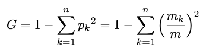
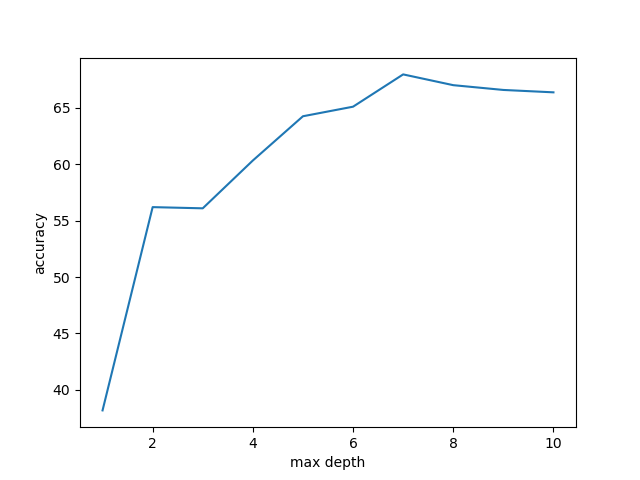

# Classifier 1: Neural Network
* In a neural network, there are many parameters that can be tweaked to give an optimal accuracy. For this dataset, we have used 192 neurons in the input layer (8 x 8 x 3 = 192), and have two hidden layers with 30 neurons each. In the output layer, we have 4 neurons corresponding to the four classes (orientation degree - 0, 90, 180, 270).
* In the feed-forward network, we first generate random initial weights and biases at each layer and do a forward propagation using <b>relu</b> as the activation function at the hidden layers and <b>softmax</b> activation function at the output layer. We have also used a dropout of 0.2 as a regularization method to avoid overfitting. 
* Next, we perform backpropagation with softmax derivative at the output layer and relu derivative at the hidden layers. 
* We have implemented batch gradient descent and cross entropy as our cost function.
* After fiddling with number of epochs, learning rate, number of hidden layer neurons and number of hidden layers, the below parameters have been chosen:
	* Number of epochs: 2000
	* Learning rate: 0.01
	* Hidden layer neurons:  30
	* Number of hidden layers: 2
* Other values of the above parameters either gave a low accuracy or ran for a long time to give a train accuracy not more than 75% (meaning the model overfit the data) 
* With these parameters, we have achieved a <b>train accuracy of 75-76%</b> and a <b>test accuracy of 72-74%</b>, making this our best model for this dataset. The accuracy fluctuates a little each time we run the model because we are initializing the weights and biases randomly. Training the model takes around 10-15 minutes and testing is done within seconds.
* Below is the graph to explain the decrease in cost (loss) as the number of epochs increases. This graph was plotted to identify overfitting. In this case, we see a gradual decrease, which shows that we are not overfitting.

* Below is a table showing the different combinations of parameters chosen and it's corresponding train and test accuracies. From the table, we suggest the first row to be the best set of parameters and have used the same as our final parameters.

| Epochs | Learning Rate | Hidden Layer Neurons | No. of Hideen Layers | Time Taken to train | Train Accuracy | Test Accuracy |
|--------|---------------|----------------------|----------------------|---------------------|----------------|---------------|
| 2000   | 0.01          | 30                   | 2                    | 10-15 mins          | 75%            | 73%           |
| 1000   | 0.01          | 30                   | 2                    | 10 mins             | 75%            | 72%           |
| 2000   | 0.01          | 35                   | 2                    | 20 mins             | 75%            | 73%           |
| 1000   | 0.001         | 30                   | 2                    | 10 mins             | 72%            | 67%           |
| 1000   | 0.1           | 30                   | 2                    | 8-10 mins           | 25%            | 25%           |

* Examples of correctly and incorrectly classified images:

Correct:

| | 
|:---:|:---:|

Incorrect:

| | 
|:---:|:---:|

* A pattern is observed in the correct and incorrectly classified images above. If an image has either or both of the opposite pair of sides similar (has similar pixel values), then it is classified incorrectly since the model is confused with the orientation (it could be 0 or 90/180 or 270). Whereas if the opposide pair of sides are distinct, the model does a right classification.

# Classifier 2: Decision Tree
Decision Tree Classifier creates a binary tree by asking relevant questions at each node and based on the answers, guides the test sample to its prediction.
## Training Data with Decision Tree
We have used 'Gini-impurity' and 'Information Gain' for finding the best split to build our decision tree.

**Gini-impurity**

Calculated as

A value between 0-1, with values closer to 1 indicating more impurity, gini impurity is the difference between 1 and the sum of squares of frequency of each label to number of samples in the train set. 

**Information Gain**

Information gain tells us how relevant a value of a feature is in giving the best split. A value that gives us the best gini impurity, has maximum information gain.
In our implementation, we consider each value of every feature to be a candidate for best split. For each value, we split the data and calculate the information gain cumulatively on the left and right split. The value with the best information gain is chosen as the best split at that node and the decision tree grows deeper.

## Maximum Depth as a Parameter
Maximum depth is what we use to decide what the depth the decision tree has. For our model, the depth with maximum accuracy is 7 with an accuracy of 67.975%. We tried for other depths also and below is a plot to describe this:

As more depths are added, there is more clear segregation of data at the leaf nodes of the tree. That is fewer samples to single sample at the leaf nodes However, when depth is more than 7, the model tends to overfit. There could be a case where each leaf node has a single sample and the tree then becomes a data structure that defines and pertains to the train set alone and nothing new can be learnt from it or can be predicted.

Our decision tree model takes around 20 minutes to train based on the given train set.

Below is an image at 270 degrees rightly classified:

**Prediction**: test/10161556064.jpg 270

And below is an image a 90 degrees wrongly classified

**Prediction**: test/10196604813.jpg 180

# Classifier 3: K-Nearest Neighbor
* K_Nearest Neighbor is a fairly straight forward algorithim that is commonly used for classification (and regression). 
* Essentialy, here, you set the value of K to some 'k'. Then, the 'k' nearest data points to the new datapoint that has to be classified are taken into account. 
* Next, the class to which the highest number of these 'k' points belong to is assigned as the class for the new datapoint. So this means that depending on the classes of a majority of the 'k' points closest to the new datapoint, the class of the new datapoint is assigned.
* Other than the value of 'k', there are not alot of parameters that alter the performance of a KNN. Very small values of 'k' will be sensitive to noise and will not be very good for classification, while very large values of 'k' will consider a large number of the population, and hence the classification will occur in favor of the class to which a majority of the population belongs to, which is not what we want. We want the classification to be based on which class the nearest k neighbors belong to.
* Below is a table showing the different choices of k values and its corresponding test accuracies. From the table, we suggest the the best value of 'k' to be about 200 (which is approx. the square root of the number of samples) and have used the same as our final parameter.

| S.No | Number of Neighbors (k) | Test Accuracy |
|------|-------------------------|---------------|
| 1.   |          1          	 | 66.232%       | 
| 2.   | 	 50              | 69.731%       |
| 3.   |         100             | 69.989%       | 
| 4.   |         200             | 71.368%       | 
| 5.   |         500             | 71.261 %      | 

**Correct Prediction**:

***Test case:***

test/10008707066.jpg 0

***Predicted:***

test/10008707066.jpg 0

**Incorrect Prediction**:

***Test case:***

test/10196604813.jpg 90

***Predicted:***

test/10196604813.jpg 0

# Inference:
From the above three classifier results, it is evident that decision tree has the least test accuracy among the three (around 67%). KNN and Neural Network have similar test accuracy (around 71 - 73%). Hence, we declare <b>Neural Network to be the best classifier for this dataset because it takes lesser time on testing and has the best accuracy (since KNN does all of its computation during testing time which makes it slower)</b>. 

# References:
### Neural Network:
* https://medium.com/@himanshuxd/activation-functions-sigmoid-relu-leaky-relu-and-softmax-basics-for-neural-networks-and-deep-8d9c70eed91e
* https://stackoverflow.com/questions/54880369/implementation-of-softmax-function-returns-nan-for-high-inputs
* https://www.quora.com/Is-the-softmax-loss-the-same-as-the-cross-entropy-loss
* https://www.coursera.org/learn/deep-neural-network/lecture/LCsCH/training-a-softmax-classifier
* https://stackoverflow.com/questions/42042561/relu-derivative-in-backpropagation
* https://stackoverflow.com/questions/46411180/implement-relu-derivative-in-python-numpy
* https://www.coursera.org/learn/neural-networks-deep-learning/lecture/MijzH/forward-propagation-in-a-deep-network
* https://www.coursera.org/learn/deep-neural-network/lecture/eM33A/dropout-regularization
* https://www.coursera.org/learn/deep-neural-network/lecture/YaGbR/understanding-dropout
* https://www.coursera.org/learn/neural-networks-deep-learning/lecture/znwiG/forward-and-backward-propagation
* https://www.coursera.org/learn/deep-neural-network/lecture/eM33A/dropout-regularization
* https://www.coursera.org/learn/deep-neural-network/lecture/YaGbR/understanding-dropout
* https://www.coursera.org/learn/deep-neural-network/lecture/LCsCH/training-a-softmax-classifier
* https://www.coursera.org/learn/neural-networks-deep-learning/lecture/znwiG/forward-and-backward-propagation)
* https://www.coursera.org/learn/machine-learning/supplement/Bln5m/model-representation-i
* https://www.coursera.org/learn/neural-networks-deep-learning/lecture/Rz47X/getting-your-matrix-dimensions-right
* https://towardsdatascience.com/random-initialization-for-neural-networks-a-thing-of-the-past-bfcdd806bf9e
* https://wiseodd.github.io/techblog/2016/06/21/nn-sgd/
* https://towardsdatascience.com/gradient-descent-in-python-a0d07285742f
* https://stackoverflow.com/questions/15474159/shuffle-vs-permute-numpy
* https://stackoverflow.com/questions/46800774/how-to-find-accuracy-of-a-model-in-cnn

### Decision Tree:
* https://towardsdatascience.com/decision-tree-from-scratch-in-python-46e99dfea775
* https://www.youtube.com/watch?v=LDRbO9a6XPU
* https://github.com/random-forests/tutorials/blob/master/decision_tree.ipynb

### KNN:
* https://www.python-course.eu/k_nearest_neighbor_classifier.php
* https://towardsdatascience.com/k-nearest-neighbor-classifier-from-scratch-in-python-698e3de97063
* https://github.com/sagarmk/Knn-from-scratch/blob/master/knn.py
* https://dataaspirant.com/2016/12/27/k-nearest-neighbor-algorithm-implementaion-python-scratch/
* https://www.kdnuggets.com/2016/01/implementing-your-own-knn-using-python.html/3
* https://medium.com/datadriveninvestor/knn-algorithm-and-implementation-from-scratch-b9f9b739c28f
* https://machinelearningmastery.com/tutorial-to-implement-k-nearest-neighbors-in-python-from-scratch/
